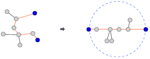

# 1967번 트리의 지름

| 시간 제한 | 메모리 제한 | 제출 | 정답 | 맞은 사람 | 정답 비율 |
| :-------- | :---------- | :--- | :--- | :-------- | :-------- |
| 2 초      | 128 MB      | 8740 | 4035 | 3104      | 49.466%   |

## 문제

트리(tree)는 사이클이 없는 무방향 그래프이다. 트리에서는 어떤 두 노드를 선택해도 둘 사이에 경로가 항상 하나만 존재하게 된다. 트리에서 어떤 두 노드를 선택해서 양쪽으로 쫙 당길 때, 가장 길게 늘어나는 경우가 있을 것이다. 이럴 때 트리의 모든 노드들은 이 두 노드를 지름의 끝 점으로 하는 원 안에 들어가게 된다.



이런 두 노드 사이의 경로의 길이를 트리의 지름이라고 한다. 정확히 정의하자면 트리에 존재하는 모든 경로들 중에서 가장 긴 것의 길이를 말한다.

입력으로 루트가 있는 트리를 가중치가 있는 간선들로 줄 때, 트리의 지름을 구해서 출력하는 프로그램을 작성하시오. 아래와 같은 트리가 주어진다면 트리의 지름은 45가 된다.


 

## 입력

파일의 첫 번째 줄은 노드의 개수 n(1 ≤ n ≤ 10,000)이다. 둘째 줄부터 n번째 줄까지 각 간선에 대한 정보가 들어온다. 간선에 대한 정보는 세 개의 정수로 이루어져 있다. 첫 번째 정수는 간선이 연결하는 두 노드 중 부모 노드의 번호를 나타내고, 두 번째 정수는 자식 노드를, 세 번째 정수는 간선의 가중치를 나타낸다. 간선에 대한 정보는 부모 노드의 번호가 작은 것이 먼저 입력되고, 부모 노드의 번호가 같으면 자식 노드의 번호가 작은 것이 먼저 입력된다. 루트 노드의 번호는 항상 1이라고 가정하며, 간선의 가중치는 100보다 크지 않은 양의 정수이다.

## 출력

첫째 줄에 트리의 지름을 출력한다.

## 예제 입력 1 

```
12
1 2 3
1 3 2
2 4 5
3 5 11
3 6 9
4 7 1
4 8 7
5 9 15
5 10 4
6 11 6
6 12 10
```

## 예제 출력 1 

```
45
```

## 나의 코드

dfs를 재귀로 구현을 해서 파이썬으로 만든 코드는 제출 시 재귀 깊이로 인해서 런타임 에러가 발생했다...

처음에 dfs탐색으로 1번 노드와 거리가 가장 먼 노드를 찾고, 찾은 노드를 시작점으로 하는 dfs탐색을 한 번 더 실행하면 되는 문제였다.

##### Python

```
def dfs(node, dist):
    global max_dist, next_root
    flag = False
    for i in range(len(nodes[node])):
        if visit[nodes[node][i][0]]:
            continue
        flag = True
        visit[nodes[node][i][0]] = 1
        dfs(nodes[node][i][0], dist + nodes[node][i][1])
        visit[nodes[node][i][0]] = 0
    if not flag:
        if dist > max_dist:
            max_dist = dist
            next_root = node

n = int(input())
nodes = [[] for _ in range(10001)]

for _ in range(n-1):
    parent, child, weight = map(int,input().split())
    nodes[parent].append((child,weight))
    nodes[child].append((parent,weight))

max_dist = 0
next_root = None

visit = [0 for _ in range(10001)]
visit[1] = 1
dfs(1,0)
max_dist = 0
visit = [0 for _ in range(10001)]
dfs(next_root,0)
print(max_dist)
```

런타임 에러가 발생해서 Java로 다시 코드를 작성했다.

```
import java.io.IOException;
import java.io.BufferedReader;
import java.io.InputStreamReader;
import java.util.StringTokenizer;
import java.util.LinkedList;

public class n1967_트리의지름 {
	static StringTokenizer st;
	static LinkedList<Node> tree[];
	static boolean visit[];
	static int deepRoot, maxDepth;
	static int stoi(String s) {
		return Integer.parseInt(s);
	}
	
	public static void main(String[] args) throws IOException{
		// TODO Auto-generated method stub
		BufferedReader br = new BufferedReader(new InputStreamReader(System.in));
		int numOfNode = stoi(br.readLine());
		tree = new LinkedList[numOfNode+1];
		visit = new boolean[numOfNode+1];
		for(int i = 0; i <= numOfNode; i++) {
			tree[i] = new LinkedList<Node>();
		}
		
		for(int i = 0; i < numOfNode-1; i++) {
			st = new StringTokenizer(br.readLine());
			int parent = stoi(st.nextToken());
			int child = stoi(st.nextToken());
			int weight = stoi(st.nextToken());
			tree[parent].add(new Node(child,weight));
			tree[child].add(new Node(parent,weight));
		}
	
		visit[1] = true;
		dfs(1,0);
		
		visit = new boolean[numOfNode+1];
		visit[deepRoot] = true;
		dfs(deepRoot,0);
		System.out.println(maxDepth);
	}
	
	static void dfs(int node, int depth) {
		if(depth > maxDepth) {
			maxDepth = depth;
			deepRoot = node;
		}
		int len = tree[node].size();
		for(int i = 0; i < len; i++) {
			Node childNode = tree[node].get(i);
			if(visit[childNode.data])continue;
			visit[childNode.data] = true;
			dfs(childNode.data, depth+childNode.weight);
		}
	}
	
	static class Node{
		int data, weight;
		
		public Node(int data, int weight){
			this.data = data;
			this.weight = weight;
		}
	}	
}
```

