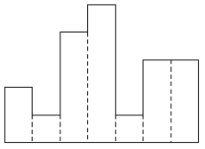
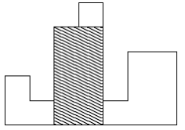

# 1725번 히스토그램

| 시간 제한 | 메모리 제한 | 제출 | 정답 | 맞은 사람 | 정답 비율 |
| :-------- | :---------- | :--- | :--- | :-------- | :-------- |
| 2 초      | 128 MB      | 7347 | 2598 | 1767      | 38.682%   |

## 문제

히스토그램에 대해서 알고 있는가? 히스토그램은 아래와 같은 막대그래프를 말한다.



각 칸의 간격은 일정하고, 높이는 어떤 정수로 주어진다. 위 그림의 경우 높이가 각각 2 1 4 5 1 3 3이다.

이러한 히스토그램의 내부에 가장 넓이가 큰 직사각형을 그리려고 한다. 아래 그림의 빗금 친 부분이 그 예이다. 이 직사각형의 밑변은 항상 히스토그램의 아랫변에 평행하게 그려져야 한다.



주어진 히스토그램에 대해, 가장 큰 직사각형의 넓이를 구하는 프로그램을 작성하시오.

## 입력

첫 행에는 N (1 ≤ N ≤ 100,000) 이 주어진다. N은 히스토그램의 가로 칸의 수이다. 다음 N 행에 걸쳐 각 칸의 높이가 왼쪽에서부터 차례대로 주어진다. 각 칸의 높이는 1,000,000,000보다 작거나 같은 자연수 또는 0이다.

## 출력

첫째 줄에 가장 큰 직사각형의 넓이를 출력한다. 이 값은 20억을 넘지 않는다.

## 예제 입력 1 

```
7
2
1
4
5
1
3
3
```

## 예제 출력 1 

```
8
```

## 나의 코드

```
# [s,e) 구간
def histogram(s,e):
    if(s == e): return 0
    if(s+1 == e): return rec[s]

    mid = (s+e)//2
    result = max(histogram(s,mid), histogram(mid,e))

    w = 1
    h = rec[mid]
    l = mid
    r = mid
    while r-l+1 < e-s:
        if l - 1 >= s:
            p = min(h,rec[l-1])
        else:
            p = -1
        if r + 1 < e:
            q = min(h,rec[r+1])
        else:
            q = -1

        if p >= q:
            h = p
            l -= 1
        else:
            h = q
            r += 1

        result = max(result,(w+1)*h)
        w += 1

    return result

n = int(input())

rec = [int(input()) for _ in range(n)]

print(histogram(0,n))
```

