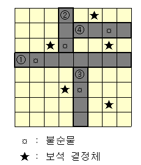

# 2339번 석판 자르기

| 시간 제한 | 메모리 제한 | 제출 | 정답 | 맞은 사람 | 정답 비율 |
| :-------- | :---------- | :--- | :--- | :-------- | :-------- |
| 2 초      | 128 MB      | 820  | 298  | 216       | 35.237%   |

## 문제

하나 이상의 불순물과 보석 결정체로 이루어진 석판을 여러 조각으로 나누어 가공해서, 보다 높은 가치를 얻을 수 있도록 만들려고 한다. 이때, 높은 가치의 석판을 만들기 위해서는 석판을 여러 조각으로 나누되, 각 조각에는 불순물이 없도록 해야하며, 보석 결정체도 단 하나씩만 포함하고 있어야 한다.

또한, 석판에서 불순물을 빼내기 위해서는 불순물을 포함하고 있는 지점을 중심으로 잘라야 되는데, 석판의 결 때문에 가로 또는 세로 방향으로만 석판을 자를 수 있다. 석판을 자를 때에는 이전에 자른 방향과 같은 방향으로는 자를 수 없다. (단, 처음에 자를 때는 가로방향이나, 세로방향 모두 가능하다.)

석판에 있는 불순물과 보석 결정체의 정보가 주어질 때, 이 석판에서 불순물들을 없애면서 석판을 나누되, 각 조각에 반드시 하나의 보석 결정체만이 들어 있도록 석판을 나누는 방법이 모두 몇 가지 존재하는지 계산하시오.



위의 그림은 초기 석판의 상태에서 불순물을 제거하면서 석판을 잘랐을 때, 최종적으로 나뉘어진 석판의 모습이다. 회색 선은 불순물을 중심으로 가로 또는 세로 방향으로 자른 경계선이고, 노란 색은 보석을 하나씩만 포함하고 있는 석판이다. 석판을 자를 때 ②번이나 ③번은 이전에 잘려진 방향, 즉 ①번의 방향과 같은 방향으로 자를 수 없으며, ④ 번도 마찬가지로 ②번과는 같은 방향으로 자를 수 없다. 단순하게 자르는 순서를 의미하는 것이 아니므로, ④번 방향이 ③번 방향과 같을 수도 있다.

잘라진 석판은 반드시 두 개의 석판이 나뉘어진 것이어야 한다. 또한 결정체가 있는 곳은 자를 수 없으며, 최종적으로 나뉘어진 석판에 두 개 이상의 결정체가 오면 안 된다.

## 입력

첫 번째 줄에는 석판의 크기 N(1≤N≤20)이 들어온다. 다음 줄부터 N줄에 걸쳐서 석판의 상태가 입력으로 들어온다. 여기서 1은 불순물을 의미하며, 2는 보석 결정체, 0은 불순물과 보석결정체가 존재하지 않는 곳을 의미한다. 이때, 보석 결정체의 수는 15개를 넘지 않으며, 각 줄에 주어지는 석판의 정보는 공백 하나로 구분한다.

## 출력

각각의 석판 안에 불순물이 없으면서 단 하나의 보석 결정체만이 있도록 주어진 석판을 나눌 때, 모두 몇 가지의 경우가 존재하는지를 출력하시오. 이때 가능한 경우가 존재하지 않으면 -1을 출력한다.

## 예제 입력 1 

```
8
0 0 0 0 0 2 0 0
0 0 0 0 0 0 1 0
0 0 2 1 0 0 2 0
0 1 0 0 0 0 0 0
0 0 0 0 0 0 0 0
0 0 0 2 1 0 0 0
0 0 0 0 0 0 2 0
0 0 0 0 0 0 0 0
```

## 예제 출력 1 

```
1
```

## 나의 코드

불순물을 기준으로 가로로 자를지 세로로 자를지 정해진 후에 양분된다.

양분하면서 분할정복 기법을 통해 답을 구한다.

중간에 결정체가 있는 부분을 자르지 못한다는 조건을 보지 못해서 한참 고생했다...

```
def jew_num(rs,re,cs,ce):
    cnt = 0
    for i in range(rs,re):
        for j in range(cs,ce):
            if graph[i][j] == 2:
                cnt += 1
    return cnt

def impurity_num(rs,re,cs,ce):
    impure_loc = []
    for i in range(rs, re):
        for j in range(cs, ce):
            if graph[i][j] == 1:
                impure_loc.append((i,j))
    return impure_loc

def rock(rs,re,cs,ce,dir):
    global ans
    jew = jew_num(rs,re,cs,ce)
    impure_loc = impurity_num(rs,re,cs,ce)
    if re <= 0 or rs >= n or ce <= 0 or cs >= n:
        return 1
    if jew == 0:
        return 0
    if jew == 1:
        if len(impure_loc)==0:
            return 1
        else:
            return 0
    if len(impure_loc) == 0:
        return 0
    result = 0
    for x,y in impure_loc:
        if dir != 1: # 세로로 자름
            flag = False
            for i in range(rs,re):
                if graph[i][y] == 2:
                    flag = True
                    break
            if not flag:
                result += rock(rs,re,cs,y,1) * rock(rs,re,y+1,ce,1)
        if dir != 0:
            flag = False
            for i in range(cs, ce):
                if graph[x][i] == 2:
                    flag = True
                    break
            if not flag:
                result += rock(rs,x,cs,ce,0) * rock(x+1,re,cs,ce,0)

    return result

n = int(input())

graph = [list(map(int,input().split())) for _ in range(n)]

ans = rock(0,n,0,n,-1)
if ans == 0:
    print(-1)
else:
    print(ans)
```

